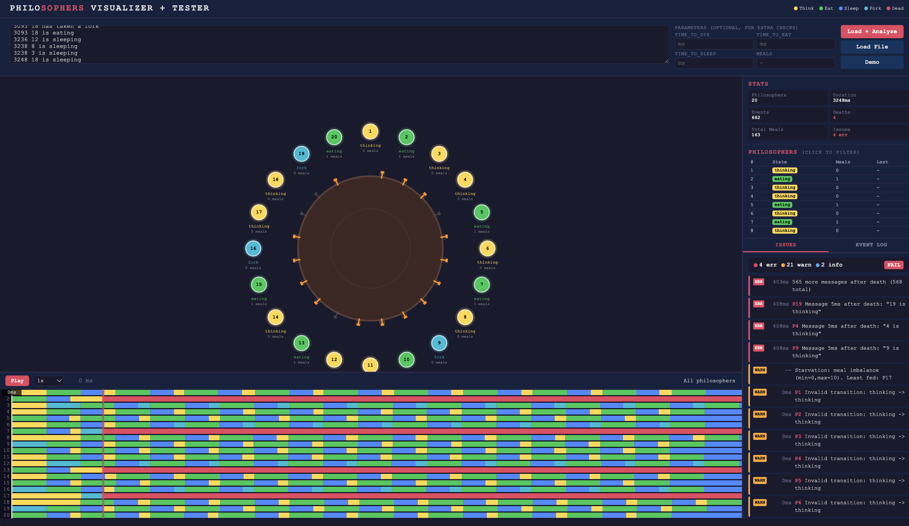

# Philosophers Visualizer

An interactive visualization and analysis tool for the **Philosophers** project at 42 school. It visually verifies the correctness of your `philo` program by parsing its output and detecting concurrency errors.




## Features

### Circular Visualization

Philosophers are arranged in a circle around the table. Each state is represented by a color:

| Color | State |
|-------|-------|
| Yellow | Thinking |
| Green | Eating |
| Blue | Sleeping |
| Cyan | Has fork |
| Red | Dead |

Forks are displayed between each philosopher with a visual ownership indicator. Meal counts are shown below each philosopher.

### Timeline / Gantt Chart

A horizontal timeline displays the state history of each philosopher. Error and warning markers are positioned directly on the timeline. A draggable cursor allows manual time scrubbing.

### Analysis Engine

The visualizer performs a deep analysis of the log and detects:

- **Format errors**: invalid lines, unknown actions
- **Logical errors**: out-of-range IDs, backward timestamps, messages after death
- **Concurrency errors**: eating without forks, fork conflicts, invalid state transitions
- **Timing violations**: death timing accuracy, eating duration (when parameters are provided)
- **Starvation**: imbalanced meal distribution across philosophers

A final verdict is given: **PASS**, **WARN**, or **FAIL**.

### Playback Controls

- Play / Pause
- Adjustable speed (0.25x to 16x)
- Keyboard shortcuts:
  - `Space`: Play/Pause
  - `Left/Right Arrow`: step backward/forward
  - `Escape`: clear selection

### Interactive Filtering

Click on a philosopher (in the circle, the table, or the log) to filter the display and show only their events.

## Usage

### 1. Open the Visualizer

Open `visualizer.html` in a modern browser. No installation, no local server, no dependencies required.

### 2. Import Your Program Output

Three options:

- **Paste** the output directly into the text area
- **Upload** a `.log` or `.txt` file
- **Demo**: load a sample dataset

### 3. Optional Parameters

For a more precise analysis, provide your simulation parameters:

- `time_to_die`
- `time_to_eat`
- `time_to_sleep`
- `meals_count`

### 4. Run the Analysis

Click **Analyze** to parse the log, generate the visualization, and display the results.

## Expected Log Format

The visualizer parses the standard output of the `philo` program in the following format:

```
timestamp_in_ms philosopher_id action
```

Example:

```
0 1 is thinking
0 1 has taken a fork
1 1 has taken a fork
1 1 is eating
201 1 is sleeping
401 1 is thinking
```

## Statistics Panel

- Philosopher count
- Simulation duration
- Total events
- Death count
- Total meals
- Detected errors

## Compatibility

Works on any modern browser (Chrome, Firefox, Safari, Edge). No external dependencies, works fully offline.

## License

Open source project for educational use within the 42 curriculum.
